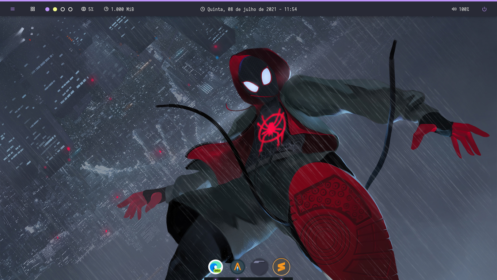

# Dotfiles

My personal dotfiles of Openbox and Arch Linux

## Installation

Clone this repository and copy to your user home

```bash
git clone https://github.com/matheuuus/dotfiles $HOME
```

## Detailed Environment

Components | Packages / Programs
--- | --- |
**Window Manager**        | `openbox`
**AppLauncher**           | `rofi`
**Bar**                   | `polybar`
**Notification Daemon**   | `dunst`
**Wallpaper Setter**      | `nitrogen`
**Compositor**            | `picom`
**Screenshot App**        | `flameshot`
**Archive Manager**       | `thunar`
**Text Editor**           | `sublime-text`
**CLI System Monitor**    | `htop`
**CLI System Information**| `neofetch`
**CLI Shell**             | `zsh`



## Contributing
Pull requests are welcome. 

## License
[MIT](https://choosealicense.com/licenses/mit/)
